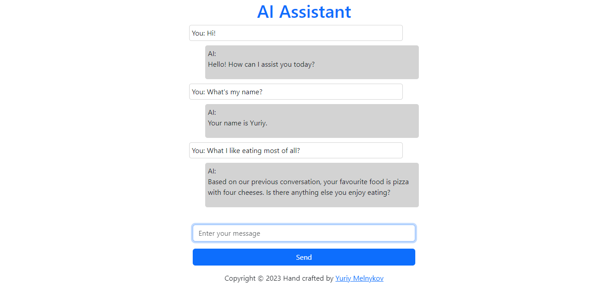

# AI Assistant



### Challenge

Using LangChain library and OpenAI API, create an application that allows user to speak to GPT-3.5-turbo. Application should save previous conversation history into a memory (Chroma), and when new conversion starts — retrieve previous conversations from memory and use them in the prompt to set the context.

### Installation

1. Sign up for an OpenAI account and get your OpenAI API key at [https://platform.openai.com/](https://platform.openai.com/)
2. Run the following command in your terminal:
- For Linux and macOS:
 ```sh
   export OPENAI_API_KEY="your_api_key_here"
   ```
 - For Windows:
 ```sh
   set OPENAI_API_KEY="your_api_key_here"
   ```
3. Clone the repo:
   ```sh
   git clone https://github.com/ymelnykov/flask-ai-assistant.git
   ```
4. Install required packages:
   ```sh
   pip install -r requirements.txt
   ```
 
 ### Usage
 
 Switch to the project directory and run the following command in your terminal:
  ```sh
 flask --app assistant run
 ```
 Enjoy chatting! 
 
